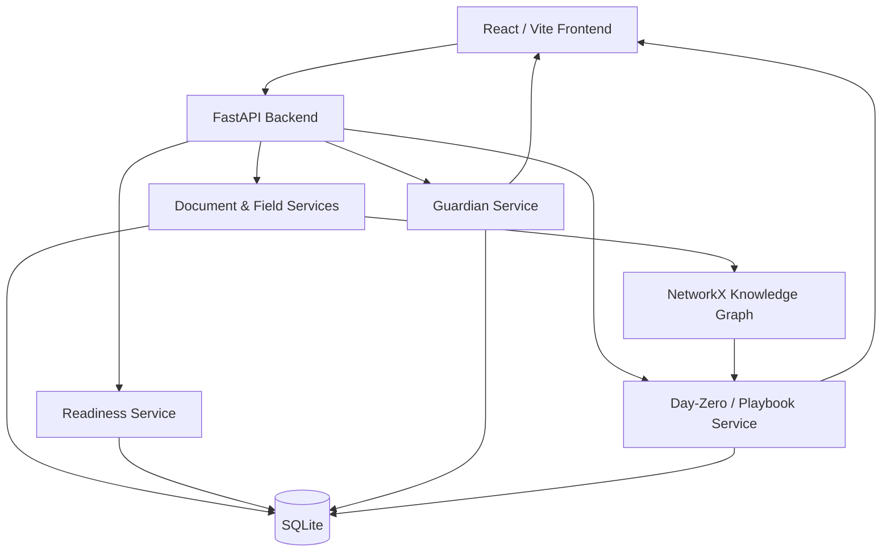
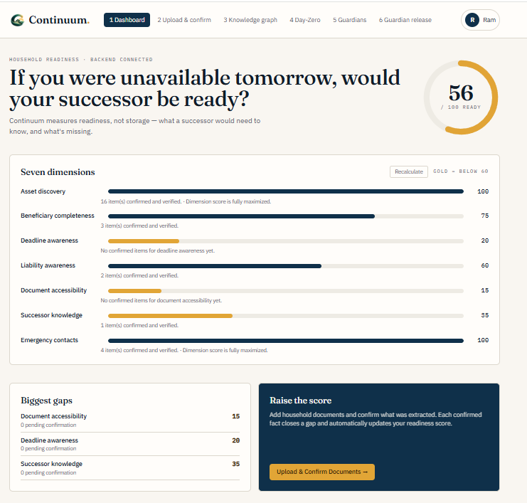
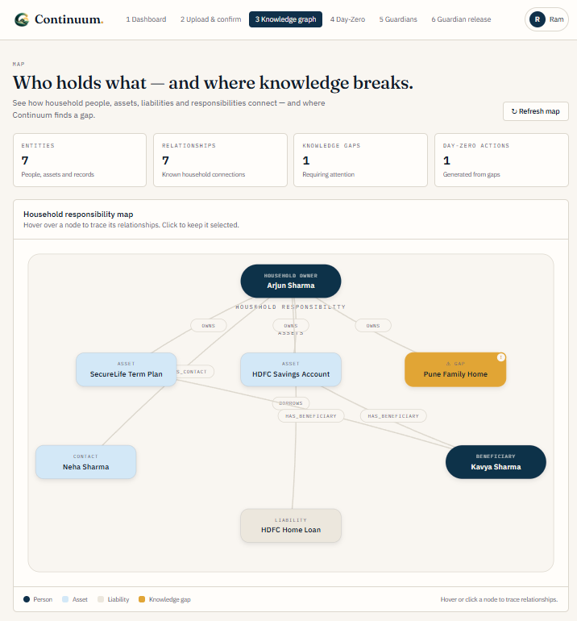
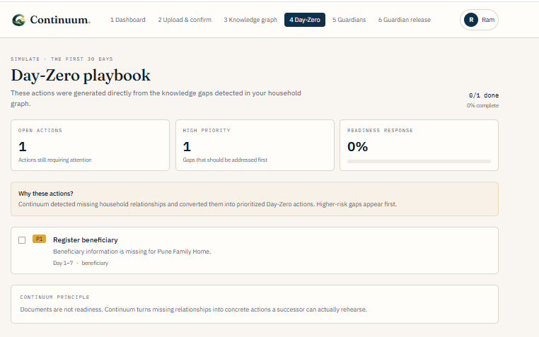
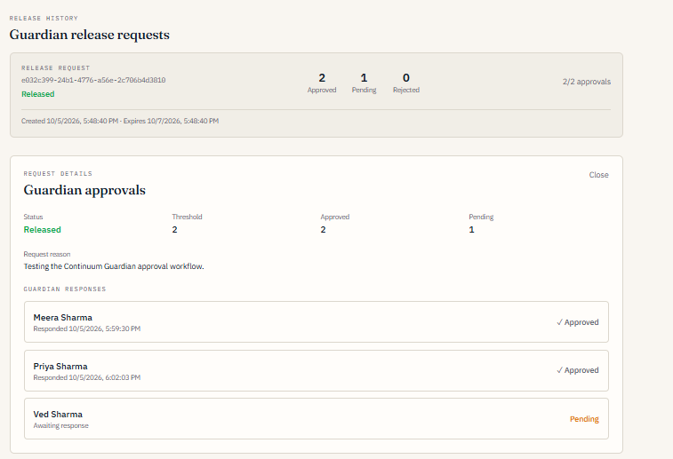

# Continuum — Successor Readiness for Households

**Team:** Clock it  
**Event:** SHE SOLVES 3.0  
**Domain:** FinTech / Digital Legacy

> **Documents are not readiness. Continuum measures it and rehearses it.**

Continuum is a working local prototype built on **synthetic data**. It is not financial advice, not legal advice, and not a production financial system.

---

## 1. Project Overview

### The Problem

In many households, one person holds most of the financial and administrative knowledge. If that person dies or becomes unavailable, the family may have to reconstruct critical information during an already difficult period.

Simply storing documents does not solve this problem. Someone still has to **find the right information, understand it, know what is missing, and act on it**.

### The Continuum Approach

Continuum treats household continuity as a **readiness problem rather than a document-storage problem**.

It transforms household information into a structured readiness workflow:

```text
UPLOAD → EXTRACT → CONFIRM → MAP → SCORE → SIMULATE → ACT
```

| Stage | What happens in the prototype |
|---|---|
| **Upload** | A household user uploads a supported document. |
| **Extract** | Fields are parsed from the document as unconfirmed records. |
| **Confirm** | The household user confirms, edits, or rejects extracted fields. |
| **Map** | Confirmed information is mapped into a household knowledge graph. |
| **Score** | A transparent rule-based engine scores seven readiness dimensions. |
| **Simulate** | Day-Zero analysis models the first 30 days after the household owner becomes unavailable. |
| **Act** | Identified gaps become prioritized tasks in the playbook. |

### Core Idea

Continuum answers a more useful question than:

> **“Where are the documents?”**

It asks:

> **“If the person who knows everything becomes unavailable tomorrow, would the household actually be ready?”**

---

## 2. Features Implemented

### 2.1 Household Intelligence

- **Authentication**
  - Signup, login, logout and `/auth/me`.
  - Signup automatically creates the household.
  - Household data is isolated between users.

- **Document Upload**
  - Multipart document upload.
  - Local file storage.
  - Configurable upload-size limit.
  - Current extraction workflow supports plain-text `.txt` / `.md` documents.

- **Extraction & Confirmation**
  - Deterministic parsing of `Key: Value` lines.
  - Extracted values initially remain unconfirmed.
  - Users can edit, confirm, or reject individual fields.
  - Confirmation state is persisted.

- **Readiness Scoring**
  - Transparent, formula-driven scoring.
  - Seven readiness dimensions.
  - Scores are calculated from confirmed information.
  - Scores update as household information changes.

### 2.2 Knowledge & Continuity

- **Household Knowledge Graph**
  - Built using NetworkX.
  - Represents household entities and relationships.
  - Identifies missing relationships and knowledge gaps.

- **Day-Zero Analysis**
  - Models the first 30 days after the household owner becomes unavailable.
  - Converts identified knowledge gaps into actionable priorities.

- **Prioritized Playbook**
  - Knowledge gaps become household tasks.
  - Tasks can be updated as progress is made.
  - Helps turn readiness gaps into concrete actions.

### 2.3 Guardian Release Workflow

Continuum includes a separate Guardian workflow designed around a clear privacy boundary:

> **Guardians approve. They do not browse.**

Implemented functionality includes:

- Household owners can create and manage Guardians.
- Guardian invitation links.
- Guardian signup through an invitation.
- Independent Guardian login.
- Dedicated Guardian Portal.
- Guardian route and API separation from the household workspace.
- Database-backed release requests.
- Approval records assigned to eligible Guardians.
- **2-of-3 Guardian approval threshold.**
- Approve / reject handling.
- `RELEASED` state after the threshold is reached.
- Persistent approval history.
- Household-owner view of release status.

Guardians do **not** receive access to:

- Household dashboard
- Private household documents
- Readiness scores
- Knowledge graph
- Household workspace routes

Approving a release request authorizes the release workflow; it does **not** provide the Guardian with unrestricted access to the household workspace.

### 2.4 Seven Readiness Dimensions

| Dimension | Weight |
|---|---:|
| Asset Discovery | 1.0 |
| Beneficiary Completeness | 1.5 |
| Deadline Awareness | 1.0 |
| Liability Awareness | 1.0 |
| Document Accessibility | 1.25 |
| Successor Knowledge | 1.5 |
| Emergency Contacts | 1.0 |

The prototype uses explicit rules rather than an AI/ML model.

```text
Dimension score = min(100, base + 20 × confirmed fields)

Overall score = weighted average of the seven dimensions
```

> Any readiness score shown by the prototype is generated from its rules and synthetic data. It is **not a real-world benchmark or financial assessment**.

---

## 3. Technology Used

| Layer | Technology | Purpose |
|---|---|---|
| **Frontend** | React 19, TanStack Start / Router, Vite, TypeScript | Household workspace and Guardian Portal |
| **UI** | Tailwind CSS 4, Radix UI, Recharts | Styling, components and visualizations |
| **Backend** | Python 3.12, FastAPI, Pydantic | REST APIs, validation and application services |
| **Database** | SQLite | Persistent application data |
| **ORM / Migrations** | SQLAlchemy 2, Alembic | Database access and schema migrations |
| **Knowledge Graph** | NetworkX | Household entities, relationships and gap analysis |
| **Authentication** | Cookie-based JWT | User authentication and session handling |
| **Security** | CSRF protection, bcrypt password hashing, CORS allow-list | Protection of state-changing requests and credentials |
| **Testing** | pytest, Vitest | Backend and frontend testing |

### AI / ML

**No AI/ML model is used in the current prototype.**

Document extraction is deterministic parsing for supported plain-text documents, and readiness scoring is implemented using explicit rules.

OCR and LLM-assisted extraction are planned future enhancements.

---

## 4. Architecture



### End-to-End Flow

```text
User
  │
  ▼
React / Vite Frontend
  │
  ▼
FastAPI Backend
  │
  ├── Authentication
  ├── Document & Field Services
  ├── Readiness Engine
  ├── Guardian Service
  └── Day-Zero / Playbook
          │
          ▼
       SQLite
          │
          ▼
  NetworkX Knowledge Graph
          │
          ▼
   Gaps → Priorities → Tasks
```

---

## 5. Project Structure

```text
.
├── backend/
│   ├── app/
│   │   ├── api/
│   │   │   └── endpoints/       # Auth, households, documents, fields, scores, tasks, graph, Guardian
│   │   ├── services/            # Extraction, readiness, graph, storage, auth, Guardian and domain services
│   │   ├── graph/               # Entities, relationships, normalizer, gap detector, builder
│   │   ├── dayzero/             # Generator and prioritizer
│   │   ├── models/              # SQLAlchemy models
│   │   ├── schemas/             # Pydantic schemas
│   │   ├── db/                  # Database configuration
│   │   ├── config.py
│   │   └── main.py
│   ├── alembic/
│   │   └── versions/            # Database migrations
│   ├── tests/
│   ├── requirements.txt
│   └── .env.example
│
├── frontend/
│   └── src/
│       ├── routes/              # Application routes and Guardian routes
│       ├── components/          # Reusable UI components
│       └── lib/                 # API client, authentication and utilities
│
└── docs/
    ├── ARCHITECTURE.md
    └── WEB_FLOW.md
```

---

## 6. How to Install and Run

### Prerequisites

Install:

- Python **3.12**
- Node.js with npm
- Git

### 6.1 Clone the Repository

```bash
git clone https://github.com/Bais-03/Continuum_sheSolves.git
cd Continuum_sheSolves
```

### 6.2 Backend Setup

#### macOS / Linux

```bash
cd backend
python3 -m venv venv
source venv/bin/activate
pip install -r requirements.txt
```

#### Windows PowerShell

```powershell
cd backend
python -m venv venv
.\venv\Scripts\Activate.ps1
pip install -r requirements.txt
```

### 6.3 Configure Environment Variables

Copy the example environment file:

```bash
cp .env.example .env
```

On Windows PowerShell:

```powershell
Copy-Item .env.example .env
```

Edit `backend/.env` and replace development placeholders where required.

For local HTTP development, keep:

```text
COOKIE_SECURE=false
```

### 6.4 Run Database Migrations

From the `backend` directory:

```bash
alembic upgrade head
```

### 6.5 Start the Backend

```bash
uvicorn app.main:app --reload --port 8000
```

The backend will be available at:

```text
http://localhost:8000
```

API documentation:

```text
http://localhost:8000/api/v1/docs
```

Health check:

```text
http://localhost:8000/api/v1/health
```

### 6.6 Start the Frontend

Open a second terminal:

```bash
cd frontend
npm install
npm run dev
```

Open the URL printed by Vite.

The backend must be running on port `8000`, and the frontend origin must be included in the backend's `ALLOWED_ORIGINS`.

---

## 7. Testing

### Backend

```bash
cd backend
pytest tests/ -v
```

### Frontend

From the project root:

```bash
cd frontend
npm test
```

---

## 8. Credentials & Setup Instructions

### Required Local Configuration

Create:

```text
backend/.env
```

from:

```text
backend/.env.example
```

No real secrets should be committed to the repository.

| Variable | Purpose |
|---|---|
| `SECRET_KEY` | JWT signing secret. Replace the development placeholder. |
| `CSRF_SECRET` | Separate secret used for CSRF protection. |
| `DATABASE_URL` | Database connection. Defaults to SQLite for local development. |
| `ALLOWED_ORIGINS` | Comma-separated frontend origins allowed by the backend. |
| `ACCESS_TOKEN_EXPIRE_MINUTES` | Authentication token lifetime. |
| `COOKIE_SECURE` | Cookie security setting. Use `false` for local HTTP development. |
| `COOKIE_SAMESITE` | Cookie SameSite policy. |
| `STORAGE_DIR` | Local document storage directory. |
| `MAX_UPLOAD_SIZE` | Maximum upload size; default is 5 MB. |

For stronger secrets during local testing, generate random values, for example:

```bash
openssl rand -hex 32
```

### Demo Credentials

No shared production credentials are included in the repository.

Create a household account from the `/signup` page.

### Guardian Demo Flow

To reproduce the Guardian workflow locally:

1. Create a household owner account.
2. Create or invite three Guardians.
3. Complete the Guardian invitation/signup flow for each Guardian.
4. Log in as the household owner.
5. Create a Guardian release request.
6. Log in as two assigned Guardians.
7. Approve the request from both Guardian accounts.
8. Return to the household owner account.
9. Verify that the request changes to `RELEASED`.
10. The third Guardian can remain pending.

The tested prototype flow follows this pattern:

```text
Household Owner
      │
      ▼
Creates Release Request
      │
      ├───────────────┐
      ▼               ▼
 Guardian 1       Guardian 2
   APPROVE           APPROVE
      │               │
      └───────┬───────┘
              ▼
       2-of-3 reached
              │
              ▼
          RELEASED

 Guardian 3
   PENDING
```

---

## 9. Screenshots

> Replace the image paths below with the final screenshot files committed to the repository.

### Dashboard — Readiness Score



The dashboard shows the seven readiness dimensions, overall readiness score and identified weak areas.

### Household Knowledge Graph



The knowledge graph visualizes confirmed household entities, relationships and identified gaps.

### Day-Zero Playbook



The Day-Zero view turns continuity gaps into prioritized actions for the first 30 days.

### Guardian 2-of-3 Release Workflow



The Guardian workflow demonstrates two approvals reaching the 2-of-3 threshold while the third Guardian remains pending. Guardians do not receive access to household documents through the approval workflow.

---

## 10. GitHub Repository

**Repository:**  
https://github.com/Bais-03/Continuum_sheSolves

The repository contains the source code, backend and frontend applications, database migrations, tests, documentation and project setup instructions.

---

## 11. Deployment & Demo

### Deployment

**N/A — the prototype is currently demonstrated through local execution.**

### Demo Video

https://www.youtube.com/watch?v=1Gdug3ZF8nk

---

## 12. Current Working Status

Continuum is a **working local prototype tested with synthetic data**.

| Area | Status |
|---|---|
| Authentication and household workspace | Working |
| Document upload and confirmation | Working |
| Readiness scoring | Working |
| Knowledge graph | Working |
| Day-Zero analysis | Working |
| Prioritized playbook | Working |
| Guardian accounts and invitations | Working |
| Guardian Portal | Working |
| Guardian access isolation | Working |
| 2-of-3 Guardian approval | Working |
| Approve / reject workflow | Working |
| `RELEASED` state | Working |
| Database persistence | Working |

### Tested Guardian Flow

The end-to-end synthetic Guardian flow has been tested as:

```text
Household owner creates release request
                ↓
Guardian Meera approves
                ↓
Guardian Priya approves
                ↓
2-of-3 threshold reached
                ↓
Request becomes RELEASED
                ↓
Guardian Ved remains pending
```

---

## 13. Known Limitations

Continuum is intentionally presented as a prototype rather than a production financial system.

### Current limitations

- Synthetic data and synthetic documents are used for the prototype.
- Document extraction currently supports plain-text `.txt` / `.md` documents using deterministic parsing.
- Scanned-document OCR is not implemented.
- LLM-assisted document extraction is not implemented.
- Production-grade security hardening is not complete.
- Client-side encryption is not implemented.
- Production deployment is not currently provided.
- Real-world document testing has not yet been completed.
- User and advisor validation has not yet been completed.
- Guardian release authorization is implemented, but approval does not currently provide unrestricted household-document browsing.

---

## 14. Future Enhancements

Planned future work includes:

- OCR for scanned documents.
- LLM-assisted extraction with appropriate human confirmation.
- Stronger production security hardening.
- Client-side encryption.
- Production-grade deployment.
- Testing with real-world document formats.
- User and financial-advisor validation.
- Measuring practical continuity outcomes such as:
  - Time required to find critical records.
  - Missed deadlines.
  - Household readiness improvement over time.

---

## 15. Privacy & Security Boundary

Continuum is designed around the principle that **readiness should not require broad access to private household information**.

The Guardian workflow therefore follows:

> **Guardians approve. They do not browse.**

Guardian accounts are separated from the household workspace at the application route and API layers.

A Guardian sees only release requests for which they have an assigned approval record.

Approval authorizes the release workflow; it does not automatically expose the household dashboard, documents, readiness score or knowledge graph to the Guardian.

This prototype-level boundary should not be interpreted as a completed production security architecture.

---

## 16. Prototype Philosophy

Continuum is based on a simple distinction:

```text
Documents ≠ Readiness
```

A household can have every important document and still be unprepared if:

- nobody knows where a document is,
- nobody understands what it means,
- beneficiaries are unclear,
- deadlines are unknown,
- liabilities are not understood,
- relationships between assets and responsibilities are missing,
- or the successor has never rehearsed what to do.

Continuum therefore moves from:

```text
Storage
   ↓
Understanding
   ↓
Readiness
   ↓
Rehearsal
   ↓
Action
```

---

## 17. Disclaimer

Continuum is a prototype using synthetic data.

It is:

- **Not financial advice**
- **Not legal advice**
- **Not a production financial system**
- **Not a substitute for professional financial, legal or estate-planning advice**

Any readiness score, recommendation or simulation shown by the prototype is generated from prototype rules and synthetic data and should not be interpreted as a real-world financial or legal assessment.

---

## 18. Team

### Clock it

**SHE SOLVES 3.0**

**Project:** Continuum — Successor Readiness for Households  
**Domain:** FinTech / Digital Legacy

> **Documents are not readiness. Continuum measures it and rehearses it.**
